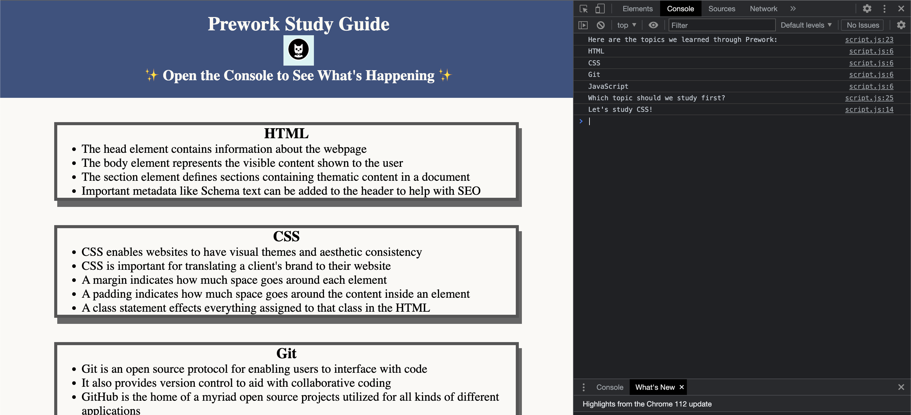

# <DU Prework Study Guide Webpage>

## Description

I set out to create a coherent guide with short explanations of the different topics discussed in the pre-course work for DU's coding bootcamp.
 - I iterated slightly on the style set out for this project, replacing the electric blue with a calmer deep azure, and a subtler white for the background.
 - This page serves as a proof of concept for a first pass learning HTML, CSS, JavaScript, and Git workflows.
 - Any student looking at this site will see a barebones but functional introduction to their course.
 - I learned how to use JavaScript to influence Chrome console content as well as how to create a page from pure HTML, something I've never done before.

## Table of Contents

If your README is long, add a table of contents to make it easy for users to find what they need.

- [Installation](#installation)
- [Usage](#usage)
- [Credits](#credits)
- [License](#license)
- [Badges](#badges)
- [Tests](#tests)

## Installation

As this is a single webpage, no installation is required other than a web browser (Chrome, FireFox, Edge, Safari) and access to the internet.

## Usage

Users may review the material included in the pre-coursework by visiting this page. However, there are a couple of hidden surprises located in the console.

To open the console, right click anywhere on the page and 

Note that the final line in the console reads  Your line may read HTML, CSS, Git, or JavaScript.

Refresh the page multiple times, and observe how the final line  as you , depending on the output of a random number generator.

## Credits

Created by [corynko], following step by step instructions from DU's BootCamp team, especially lernantino (https://github.com/lernantino). 

The tutorial can be found here (https://courses.bootcampspot.com/courses/3652/modules), but requires a login for the course. 

## License

MIT License

Copyright (c) [2023] [corynko]

Permission is hereby granted, free of charge, to any person obtaining a copy
of this software and associated documentation files (the "Software"), to deal
in the Software without restriction, including without limitation the rights
to use, copy, modify, merge, publish, distribute, sublicense, and/or sell
copies of the Software, and to permit persons to whom the Software is
furnished to do so, subject to the following conditions:

The above copyright notice and this permission notice shall be included in all
copies or substantial portions of the Software.

THE SOFTWARE IS PROVIDED "AS IS", WITHOUT WARRANTY OF ANY KIND, EXPRESS OR
IMPLIED, INCLUDING BUT NOT LIMITED TO THE WARRANTIES OF MERCHANTABILITY,
FITNESS FOR A PARTICULAR PURPOSE AND NONINFRINGEMENT. IN NO EVENT SHALL THE
AUTHORS OR COPYRIGHT HOLDERS BE LIABLE FOR ANY CLAIM, DAMAGES OR OTHER
LIABILITY, WHETHER IN AN ACTION OF CONTRACT, TORT OR OTHERWISE, ARISING FROM,
OUT OF OR IN CONNECTION WITH THE SOFTWARE OR THE USE OR OTHER DEALINGS IN THE
SOFTWARE.

## Badges

## Tests

Follow the instructions outlined in [Usage](#usage) to test the randomTopic generator outlined there, and observe how it impacts the console log you see on your screen.